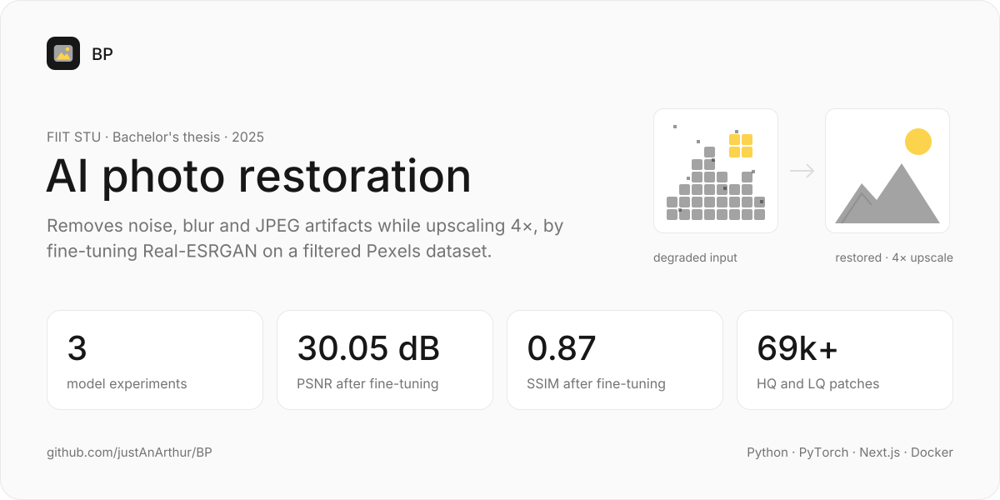
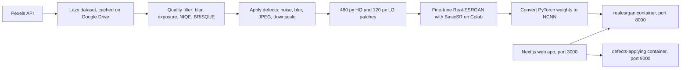

<a href="https://github.com/justAnArthur/BP"></a>

# Photo Restoration using Artificial Intelligence

Restores degraded photos (noise, blur, JPEG artifacts, low resolution) with a fine-tuned Real-ESRGAN model, served by a dockerized API and a Next.js web app. Bachelor's thesis at FIIT STU, supervised by doc. Ing. Giang Nguyen Thu, PhD., submitted in May 2025.

> Finished and archived. Fine-tuning raised PSNR and SSIM, but blind quality metrics and visual checks rated the fine-tuned model below the stock Real-ESRGAN; the thesis blames mainly the quality of the crawled dataset.

## What it does

- Crawls stock photos from the Pexels API across 8 categories (portraits, architecture, nature, textures, indoor, text, night, misc) through a lazy, cached dataset
- Filters out weak images by blur (variance of Laplacian), exposure, NIQE and BRISQUE; more than 70% of the fetched images were dropped
- Degrades images on purpose: Gaussian, salt-and-pepper, speckle and Poisson noise, blur, JPEG compression and downscaling, each with an adjustable strength
- Trains two custom super-resolution CNNs (residual blocks, then residual dense blocks) and fine-tunes Real-ESRGAN x4plus on the prepared patches
- Serves the model as NCNN weights behind a Python API, next to a defects server and a Next.js front end, all in Docker Compose

## How it works

The dataset side runs in Jupyter notebooks on Google Colab: crawl, filter, degrade, then cut 480 × 480 px high-quality patches (stride 256) with 4× smaller low-quality twins. Fine-tuned PyTorch weights are converted to NCNN with chaiNNer so the `realesrgan-ncnn-vulkan` binary can run them. The web app sends an upload to the model container, and can first send it to the defects server to show how the model copes with a damaged input.



## Results

All runs used Google Colab with one NVIDIA A100 (40 GB).

| Experiment | Model | Training | Outcome |
|---|---|---|---|
| 01 | Custom CNN: 16 residual blocks, PixelShuffle upsampling, VGG19 perceptual loss | 5,000 nature photos, downscaling only, 20 epochs | PSNR about 31.8 dB, SSIM about 0.86, inference 0.45–0.51 ms per sample |
| 02 | Same CNN with residual dense blocks | Same photos plus random defects, rotation, flips and crops | Loss and PSNR barely moved; stopped after 10 epochs |
| 03 | Real-ESRGAN x4plus, fine-tuned with BasicSR | 69,000+ HQ and LQ patches, batch size 2, 5,000 epochs | PSNR 28.57 → 30.05 dB, SSIM 0.82 → 0.87, yet blind metrics and visual checks fell below the stock model |

The thesis concludes that transfer learning beat training from scratch, and that dataset quality and Colab limits (12-hour sessions, one GPU, small batches) held the results back.

## Run

The application lives in the `application` submodule.

```bash
git clone --recurse-submodules https://github.com/justAnArthur/BP
cd BP/application
docker-compose build
docker-compose up        # web app on http://localhost:3000
```

Inside Docker the model falls back to the CPU and takes minutes per image; on bare metal with Vulkan on an integrated GPU it took a few seconds. Training and fine-tuning run from the notebooks in `projects/super-resolution-nn` (`v1`–`v3.main.ipynb`).

The submodules (`application`, `latex`, `projects/*`) point to private repositories, so a public clone contains this umbrella repo, the thesis PDFs and the `denoising` / `mnist-denoising` practice notebooks.

## Stack

Python 3.11, PyTorch, BasicSR, Real-ESRGAN, NCNN with Vulkan, Jupyter on Google Colab; Next.js 15 with React 19 and TypeScript for the web app; Docker Compose.

## Documentation

- [BP_Artur_Kozubov.pdf](BP_Artur_Kozubov.pdf): the thesis (English, 102 pages, May 2025)
- [BP1_Artur_Kozubov.pdf](BP1_Artur_Kozubov.pdf): the first-semester (BP1) version, January 2025
- [BP1_Artur_Kozubov.zip](BP1_Artur_Kozubov.zip): the BP1 submission, report plus super-resolution notebooks
- [yonban.md](yonban.md): the thesis assignment (Slovak)

## License

[CC BY-NC-ND 4.0](LICENSE): share it with credit, but no changes and no commercial use. Don't hand it in as your own coursework.

---

## Original README

### Annotation

Photo restoration, as a computer vision field, has always required intensive manual labor
in traditional restoration tasks, never satisfying scalability in modern applications. In
recent years, with the rapid development of AI, especially the invention of deep learning
methods such as CNNs and GANs, the quality of the whole restoration process has
gone to a new level. This project aims to devise with solution in photo restoration,
by developing a system that utilizes the advantages of AI models to enhance images
and remove visible defects, such as noise, blur, and compression artifacts. And also
presents dockerized solution with API and web-based application to demonstrate the
capabilities of the model.

Keywords: Photo Restoration, Deep Learning, Neural Networks, Image defects

### Introduction

Introduction
Photo restoration has always been a difficult task that demanded considerable efforts
from experts to restore damaged or lost image details. These days, after neural networks became commonly used with deep
learning techniques, new horizons have
opened for this area, and a great advance has been achieved. Modern deep learning-based approaches can be fully
automated, and they therefore present high-quality
results and huge savings on processing time.
Today, such approaches are already in use or are planned to be deployed in many areas where the demands on image
reconstruction accuracy and speed are high.
Medical imaging is one of the areas where AI-based image restoration methods are applied to clean medical images,
allowing for better diagnosis and treatment of patients.
For space and aerial images, superior algorithms result in sharper and more detailed
views of the Earth’s surface for mapping, environmental monitoring, and even military
applications.
Image restoration technologies in the forensic and security areas help improve facial recognition and evidence analysis,
increasing the efficiency of investigations.
Enhanced AI will be able to be used to create more powerful visual systems for autonomous vehicles, which will provide
more reliable recognition of objects and traffic conditions.
In this manner, the development of artificial intelligence-based photo restoration methods has solved not only the
problem of image restoration but also opened wide perspectives.

### Project structure

```
├── application/                                <-- Full-stack application source code folder, divided into modules
│   ├── apps/                                   
│   │   ├── defects-applying/                   <-- Python module for applying defects to images
│   │   └── web/                                <-- Next.js front-end application
│   ├── models/
│   │   └── Real-ESRGAN_x4plus-finetuned/       <-- Python module for hoisting the fine-tuned model 
│   │       ├── models/
│   │       │   ├─ net_g_latest_*.pth*          <-- Fine-tuned model weights in PyTorch format
│   │       │   └─ net_g_latest_*.bin*/.param*  <-- Fine-tuned model weights in NCNN format
│   │       ├── realesrgan-ncnn-vulkan*         <-- Linux executable for running the model
│   │       └── realesrgan-ncnn-vulkan.exe*     <-- Windows executable for running the model
│   ├── docker-compose.yml*                     <-- Docker Compose file for running the application
├── latex/                                      <-- LaTeX files for the paper with all assets and scripts for draws
├── projects/
│   ├── denoising/                              <-- Several projects for learning and practice in image restoration
│   ├── digit-classification-scratch/           <-- .
│   ├── mnist-denoising/                        <-- .
│   ├── mri-brain-denoising-nn/                 <-- .
│   ├── simple-autoencoder/                     <-- .
│   └── super-resolution-nn/                    <-- Main codes for the image restoration model
│       ├── degrade_image.py*                   <-- Python script for degrading images 
│       ├── degraded_dataset.py*                <-- Dataset class that uses degradation function
│       ├── pexels_lazy_dataset.py*             <-- Handles lazy loading of images from Pexels 
│       ├── quality_filter.py*                  <-- Python script for filtering images based on several metrics
│       ├── real-esrgan/                        <-- Real-ESRGAN Git submodule, fork of open-source repository
│       ├── requirements.txt*                   <-- Python requirements file
│       ├── v1.main.ipynb*                      <-- Jupyter notebook that was used to train the first model
│       ├── v2.main.ipynb*                      <-- Jupyter notebook that was used to train the second model
│       └── v3.main.ipynb*                      <-- Jupyter notebook that was used to fine-tune the final model

├── datasets/
│   ├── fine-tune/                              <-- The final dataset used for fine-tuning the Real-ESRGAN model
```
